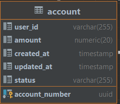
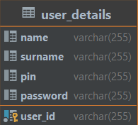

# unitech-app

- [Introduction](#introduction)
- [API](#api)
- [DATABASE](#database)

# Introduction

UniTech Api

# API

## Account

| End-point                         | Method | Description     |
|-----------------------------------|--------|-----------------|
| /uni-tech-process/v1//all/user    | GET    | get all account |
| /uni-tech-process/transfer/amount | POST   | transfer amount |

## User Register

| End-point                     | Method | Description   |
|-------------------------------|--------|---------------|
| /uni-tech-process/v1/register | POST   | register user |

## Currency Convert

| End-point                     | Method | Description      |
|-------------------------------|--------|------------------|
| /uni-tech-process/v2/currency | GET    | convert currency |

# DATABASE

